# Application Architecture

```mermaid
graph TB
    %% User Interface Layer
    subgraph UI["🏠 User Interface Layer"]
        Home["🏠 Home Page<br/>Municipality Selection"]
        Scan["📷 Scan Page<br/>Camera Feed"]
        Review["✅ Review Page<br/>Inspection Review"]
        Admin["📊 Admin Page<br/>Inspections List"]
    end

    %% Component Layer
    subgraph Components["🎨 Component Layer"]
        CameraSurface["📹 CameraSurface<br/>Video + Detection"]
        ReviewCard["📋 ReviewCard<br/>Draft Review"]
        AdminTable["📋 AdminTable<br/>Inspections Display"]
        CounterPills["🔢 CounterPills<br/>Count Adjusters"]
        FillGauge["📊 FillGauge<br/>Fill Percentage"]
        LogViewer["📝 LogViewer<br/>Dev Logs"]
        ThemeProvider["🎨 ThemeProvider<br/>Municipality Themes"]
    end

    %% State Management
    subgraph State["🔄 State Management"]
        DraftStore["💾 Draft Store<br/>Zustand + SessionStorage"]
        ThemeContext["🎨 Theme Context<br/>Municipality Themes"]
    end

    %% Business Logic Layer
    subgraph Business["🎯 Business Logic Layer"]
        Detection["🔍 Detection Service<br/>COCO-SSD"]
        FaceBlur["👤 Face Blur Service<br/>BlazeFace"]
        DataService["💾 Data Service<br/>Inspections CRUD"]
        CSVExport["📄 CSV Export<br/>Inspections to CSV"]
        PosterGen["🖼️ Poster Generator<br/>PNG Export"]
        ImageProc["🖼️ Image Processing<br/>Resize & Compress"]
    end

    %% AI/ML Layer
    subgraph AI["🧠 AI/ML Layer"]
        TensorFlow["⚡ TensorFlow.js<br/>Core Engine"]
        COCOModel["🎯 COCO-SSD Model<br/>Object Detection"]
        BlazeModel["👤 BlazeFace Model<br/>Face Detection"]
        Backends["🔧 Backends<br/>WebGL / WASM"]
    end

    %% Storage Layer
    subgraph Storage["💾 Storage Layer"]
        SessionStorage["📦 SessionStorage<br/>Draft Inspections"]
        IndexedDB["🗄️ IndexedDB<br/>via LocalForage<br/>Saved Inspections"]
    end

    %% Browser APIs
    subgraph Browser["🌐 Browser APIs"]
        MediaDevices["📹 MediaDevices API<br/>Camera Access"]
        Canvas["🖼️ Canvas API<br/>Image Processing"]
        FileSystem["📁 File System API<br/>Downloads"]
    end

    %% Flow connections
    Home -->|Navigate| Scan
    Home -->|Navigate| Admin
    Scan -->|Navigate| Review
    Review -->|Navigate| Admin
    Review -->|Navigate| Scan

    Scan --> CameraSurface
    Review --> ReviewCard
    Admin --> AdminTable
    ReviewCard --> CounterPills
    ReviewCard --> FillGauge

    CameraSurface --> Detection
    CameraSurface --> FaceBlur
    CameraSurface --> DraftStore
    CameraSurface --> ThemeContext

    ReviewCard --> DraftStore
    ReviewCard --> DataService
    ReviewCard --> CounterPills
    ReviewCard --> FillGauge

    AdminTable --> DataService
    AdminTable --> CSVExport
    AdminTable --> PosterGen

    Detection --> COCOModel
    FaceBlur --> BlazeModel
    COCOModel --> TensorFlow
    BlazeModel --> TensorFlow
    TensorFlow --> Backends

    DraftStore --> SessionStorage
    DataService --> IndexedDB

    CameraSurface --> MediaDevices
    FaceBlur --> Canvas
    ImageProc --> Canvas
    CSVExport --> FileSystem
    PosterGen --> FileSystem

    ThemeProvider --> ThemeContext
    Home --> ThemeProvider
    Scan --> ThemeProvider
    Review --> ThemeProvider
    Admin --> ThemeProvider

    %% Styling
    classDef uiLayer fill:#3b82f6,stroke:#1e40af,stroke-width:2px,color:#fff
    classDef componentLayer fill:#8b5cf6,stroke:#6d28d9,stroke-width:2px,color:#fff
    classDef stateLayer fill:#ec4899,stroke:#be185d,stroke-width:2px,color:#fff
    classDef businessLayer fill:#10b981,stroke:#059669,stroke-width:2px,color:#fff
    classDef aiLayer fill:#f59e0b,stroke:#d97706,stroke-width:2px,color:#fff
    classDef storageLayer fill:#ef4444,stroke:#dc2626,stroke-width:2px,color:#fff
    classDef browserLayer fill:#06b6d4,stroke:#0891b2,stroke-width:2px,color:#fff

    class Home,Scan,Review,Admin uiLayer
    class CameraSurface,ReviewCard,AdminTable,CounterPills,FillGauge,LogViewer,ThemeProvider componentLayer
    class DraftStore,ThemeContext stateLayer
    class Detection,FaceBlur,DataService,CSVExport,PosterGen,ImageProc businessLayer
    class TensorFlow,COCOModel,BlazeModel,Backends aiLayer
    class SessionStorage,IndexedDB storageLayer
    class MediaDevices,Canvas,FileSystem browserLayer
```

## Architecture Overview

### 🏠 User Interface Layer
- **Home Page**: Municipality selection and navigation
- **Scan Page**: Real-time camera feed with object detection
- **Review Page**: Review and edit inspection before saving
- **Admin Page**: View all saved inspections with export options

### 🎨 Component Layer
- **CameraSurface**: Main camera interface with detection overlay
- **ReviewCard**: Draft inspection review interface
- **AdminTable**: Inspections list with actions
- **CounterPills**: Adjustable count controls
- **FillGauge**: Fill percentage slider and visualization
- **LogViewer**: Development logging interface
- **ThemeProvider**: Municipality-specific theming system

### 🔄 State Management
- **Draft Store**: Zustand store with sessionStorage persistence for draft inspections
- **Theme Context**: React context for municipality theme management

### 🎯 Business Logic Layer
- **Detection Service**: COCO-SSD object detection (bottles, cups, utensils)
- **Face Blur Service**: BlazeFace face detection and anonymization
- **Data Service**: CRUD operations for inspections
- **CSV Export**: Convert inspections to CSV format
- **Poster Generator**: Generate PNG posters from inspections
- **Image Processing**: Resize and compress images

### 🧠 AI/ML Layer
- **TensorFlow.js**: Core ML framework running in browser
- **COCO-SSD Model**: Pre-trained object detection model
- **BlazeFace Model**: Pre-trained face detection model
- **Backends**: WebGL (GPU) and WASM (CPU) execution backends

### 💾 Storage Layer
- **SessionStorage**: Temporary draft inspections (cleared on tab close)
- **IndexedDB**: Persistent storage for saved inspections via LocalForage

### 🌐 Browser APIs
- **MediaDevices API**: Camera access and video stream
- **Canvas API**: Image processing and face blurring
- **File System API**: Download CSV and PNG files

## Data Flow

1. **Capture Flow**: User → CameraSurface → Detection → FaceBlur → DraftStore → ReviewCard
2. **Save Flow**: ReviewCard → DataService → IndexedDB → AdminTable
3. **Export Flow**: AdminTable → CSVExport/PosterGen → FileSystem → Download
4. **Theme Flow**: URL Parameter → ThemeProvider → ThemeContext → All Components

## Key Features

- ✅ **On-Device AI**: All ML models run locally in the browser
- ✅ **Privacy-First**: Faces automatically anonymized on capture
- ✅ **Municipality Theming**: Dynamic color themes per municipality
- ✅ **Offline-First**: All data stored locally, no server required
- ✅ **Real-Time Detection**: Live object detection on camera feed
- ✅ **Export Capabilities**: CSV and PNG poster generation

