# Data Model

## Overview
This document defines the complete data model for the application, including all entities, their relationships, and storage locations.

## Entity Relationship Diagram


## Data Structures

### Municipality
**Location**: `src/lib/constants.ts`  
**Storage**: In-memory constant array  
**Purpose**: Configuration data for municipalities and their themes

```typescript
interface Municipality {
  id: string;                    // Unique identifier (e.g., 'demo-miami')
  name: string;                  // Display name (e.g., 'Miami')
  region: string;                // Geographic region (e.g., 'South Florida')
  description?: string;          // Optional description
  theme: MunicipalityTheme;      // UI theme configuration
}

interface MunicipalityTheme {
  primary: string;               // Main action color (muted)
  primaryHover: string;         // Hover state color
  accent: string;                // Highlight color
  cardBg: string;                // Card background (tinted dark)
  border: string;                // Border color (muted)
  textAccent: string;           // Accent text color
}
```

**Example**:
```typescript
{
  id: 'demo-miami',
  name: 'Miami',
  region: 'South Florida',
  description: 'Miami-Dade County coastal areas',
  theme: {
    primary: 'rgb(20, 184, 166)',
    primaryHover: 'rgb(15, 118, 110)',
    accent: 'rgb(13, 148, 136)',
    cardBg: 'rgb(19, 38, 42)',
    border: 'rgb(45, 78, 85)',
    textAccent: 'rgb(94, 234, 212)',
  }
}
```

### DraftInspection
**Location**: `src/lib/store.ts`  
**Storage**: `sessionStorage` (key: `'sop-draft'`) via Zustand persist middleware  
**Purpose**: Temporary draft state during capture → review → save flow  
**Lifecycle**: Created on capture, updated during review, cleared after save

```typescript
type DraftInspection = {
  id: string;                    // UUID generated on first set()
  createdAt: string;              // ISO timestamp generated on first set()
  municipalityId: string;         // Selected municipality ID (FK to Municipality)
  counts: {                       // Object counts from detection
    bottle: number;
    cup: number;
    utensils: number;             // Merged count of fork, knife, spoon
  };
  fillPercent: number;            // 0-100, user adjustable
  litersEst: number;              // Calculated from fillPercent
  imgDataUrl: string;             // Base64 compressed image (data:image/...)
};
```

**Validation**: No validation (draft can be incomplete)  
**Default Values**:
- `id`: Generated UUID
- `createdAt`: Current ISO timestamp
- `municipalityId`: Default municipality ID
- `counts`: `{ bottle: 0, cup: 0, utensils: 0 }`
- `fillPercent`: `0`
- `litersEst`: `0`
- `imgDataUrl`: `''`

### Inspection
**Location**: `src/lib/schemas.ts`  
**Storage**: `IndexedDB` (key: `'sop-inspections'`) via localforage  
**Purpose**: Permanent storage of completed inspections  
**Validation**: Zod schema validation before save

```typescript
type Inspection = {
  id: string;                     // Same as draft.id (UUID)
  createdAt: string;              // Same as draft.createdAt (ISO timestamp)
  municipalityId: string;          // Same as draft.municipalityId (FK to Municipality)
  counts: {                        // Same as draft.counts
    bottle: number;
    cup: number;
    utensils: number;
  };
  fillPercent: number;             // Same as draft.fillPercent (0-100)
  litersEst: number;               // Same as draft.litersEst (≥ 0)
  imageAnonymizedDataUrl: string;  // Same as draft.imgDataUrl (data:image/...)
};
```

**Zod Schema Constraints**:
- `id`: `z.string()`
- `createdAt`: `z.string()`
- `municipalityId`: `z.string()`
- `counts.bottle`: `z.number()`
- `counts.cup`: `z.number()`
- `counts.utensils`: `z.number()`
- `fillPercent`: `z.number().min(0).max(100)`
- `litersEst`: `z.number().min(0)`
- `imageAnonymizedDataUrl`: `z.string().startsWith('data:image/')`

**Storage Format**: Array of `Inspection` objects  
**Operations**:
- `saveInspection(inspection)`: Reads array, appends new inspection, saves back
- `listInspections()`: Reads array, sorts by `createdAt` (newest first)

## Data Flow Diagram

```mermaid
flowchart LR
    subgraph Capture["📷 Capture Phase"]
        Camera["Camera Feed"]
        Detection["Object Detection<br/>COCO-SSD"]
        FaceBlur["Face Blur<br/>BlazeFace"]
        ImageCompress["Image Compression"]
    end
    
    subgraph Draft["📝 Draft State"]
        DraftStore["DraftInspection<br/>sessionStorage"]
    end
    
    subgraph Review["✅ Review Phase"]
        UserEdit["User Edits<br/>Counts & Fill %"]
        Validation["Zod Validation"]
    end
    
    subgraph Persistence["💾 Persistent Storage"]
        InspectionDB["Inspection[]<br/>IndexedDB"]
    end
    
    Camera --> Detection
    Detection --> FaceBlur
    FaceBlur --> ImageCompress
    ImageCompress -->|"setDraft()"| DraftStore
    DraftStore -->|"useDraft().current"| UserEdit
    UserEdit -->|"set()"| DraftStore
    DraftStore -->|"onSave()"| Validation
    Validation -->|"saveInspection()"| InspectionDB
    
    style DraftStore fill:#1e293b,stroke:#5eead4,stroke-width:2px,color:#fff
    style InspectionDB fill:#0f172a,stroke:#22d3ee,stroke-width:2px,color:#fff
```



## Field Mappings

### DraftInspection → Inspection
When saving a draft inspection, the following field mapping occurs:

| DraftInspection Field | Inspection Field | Notes |
|----------------------|------------------|-------|
| `id` | `id` | Direct copy (UUID) |
| `createdAt` | `createdAt` | Direct copy (ISO timestamp) |
| `municipalityId` | `municipalityId` | Direct copy (FK reference) |
| `counts` | `counts` | Direct copy (object with bottle, cup, utensils) |
| `fillPercent` | `fillPercent` | Direct copy (0-100) |
| `litersEst` | `litersEst` | Direct copy (calculated value) |
| `imgDataUrl` | `imageAnonymizedDataUrl` | Direct copy (renamed field) |

## Relationships

### Municipality → Inspection (One-to-Many)
- One `Municipality` can have many `Inspection` records
- Relationship maintained via `municipalityId` foreign key
- Municipality data is static (defined in constants)
- Inspections reference municipality by ID

### DraftInspection → Inspection (One-to-One)
- One `DraftInspection` becomes exactly one `Inspection` when saved
- Same `id` is preserved during conversion
- Draft is cleared after successful save

## Storage Locations

### sessionStorage
- **Key**: `'sop-draft'`
- **Content**: Single `DraftInspection` object (or undefined)
- **Access**: Via Zustand persist middleware
- **Lifecycle**: Cleared on browser close or after save
- **File**: `src/lib/store.ts`

### IndexedDB
- **Key**: `'sop-inspections'`
- **Content**: Array of `Inspection` objects
- **Access**: Via localforage (`src/lib/data.ts`)
- **Lifecycle**: Persistent across browser sessions
- **Operations**:
  - `saveInspection(inspection)`: Append to array
  - `listInspections()`: Read and sort array

### In-Memory Constants
- **Location**: `src/lib/constants.ts`
- **Content**: `MUNICIPALITIES` array
- **Access**: Direct import
- **Lifecycle**: Application lifetime

## Data Validation

### Draft State
- **No validation**: Draft can be incomplete or invalid
- **Purpose**: Allow users to work with incomplete data

### Saved State
- **Zod validation**: All fields validated before save
- **Schema**: `InspectionSchema` in `src/lib/schemas.ts`
- **Failure**: Validation errors prevent save, draft remains unchanged

## Related Documentation

- **State Management**: See `docs/STATE_MANAGEMENT_DIAGRAM.md`
- **Architecture**: See `docs/ARCHITECTURE.md`
- **Schemas**: See `src/lib/schemas.ts`
- **Store**: See `src/lib/store.ts`
- **Data Service**: See `src/lib/data.ts`
- **Constants**: See `src/lib/constants.ts`

